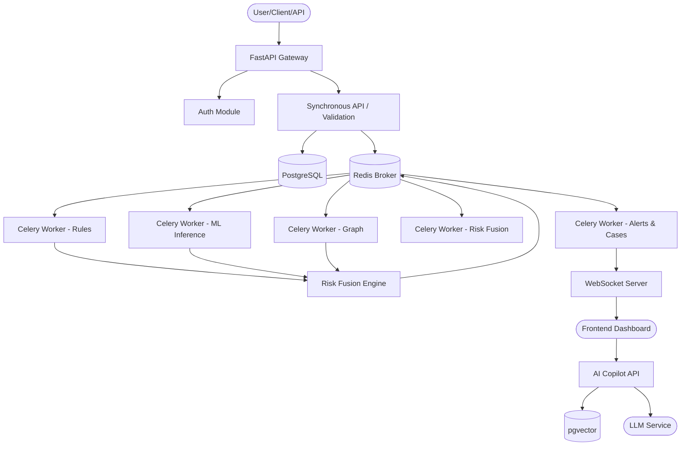

# System Architecture Blueprint

## Core Principle
**ONE EVENT → MULTIPLE INTELLIGENCE → ONE EXPLAINABLE DECISION**

## Technology Stack
- **Backend:** Python, FastAPI, Pydantic, SQLAlchemy, Alembic
- **Database:** PostgreSQL (with pgvector for embeddings)
- **Event/Async:** Redis (Broker/Cache), Celery (Workers), WebSockets
- **Machine Learning:** NumPy, Pandas, scikit-learn, XGBoost / LightGBM, SHAP
- **Graph:** NetworkX (architecture allows future Neo4j integration)
- **Frontend:** Next.js, React, TypeScript, Tailwind CSS
- **Deployment:** Docker, Docker Compose

## Component Architecture

## Failure / Fallback Architecture
- **ML Unavailable:** Engine falls back to Rules + Deterministic signals.
- **Graph Unavailable:** Graph signals omitted; Risk Fusion adjusts weights to remaining signals.
- **LLM Unavailable:** Structured investigation tools (rules/DB query) continue working; AI chat disabled.
- **Vector Search Unavailable:** Fallback to structured SQL text search.
- **Forecasting Unavailable:** Historical trend analytics are displayed instead.

## Observability Architecture
- **Logs:** Application logs with JSON formatting, Audit Logs for sensitive operations.
- **Tracing:** Request IDs, Correlation IDs (event flow), Trace IDs (distributed).
- **Metrics:** Request latency, queue length, ML inference times, Error rates.

## Synthetic Data Generator
- Dedicated CLI/module `synthetic_gen`.
- Generates: Customers, accounts, randomized realistic transactions.
- Injects: Anomalies, mule patterns, ATO behaviors.\n