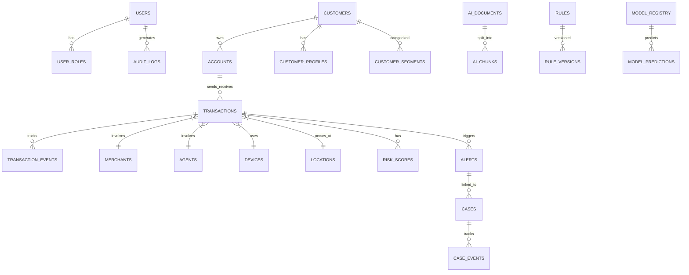

# Database Architecture (PostgreSQL + pgvector)

## Entity Relationship Model

## Core Tables
1. **users:** id (PK), email, password_hash, is_active.
2. **roles:** id (PK), name, permissions (JSONB).
3. **customers:** id (PK), name, kyc_status, risk_rating.
4. **accounts:** id (PK), customer_id (FK), balance, currency.
5. **transactions:** id (PK), sender_account (FK), receiver_account (FK), amount, type, status, created_at.
6. **devices/locations:** device_fingerprint (PK), ip_address, coordinates.
7. **merchants/agents:** id (PK), name, category, tier.
8. **alerts:** id (PK), transaction_id (FK), rule_triggered, severity, status.
9. **cases:** id (PK), alert_id (FK), investigator_id (FK), status, summary.
10. **risk_scores:** id (PK), transaction_id (FK), rules_score, ml_score, graph_score, final_score.
11. **rules/rule_versions:** id (PK), logic (JSON), is_active.
12. **ai_chunks:** id (PK), document_id (FK), content, embedding (VECTOR).
13. **investigator_feedback:** id (PK), case_id (FK), is_false_positive, notes.

## Security & Privacy
- **Masking:** PII (SSN, Phone, Email) masked at API layer.
- **Sensitive Data:** Encrypted at rest. Hashed passwords (bcrypt).\n