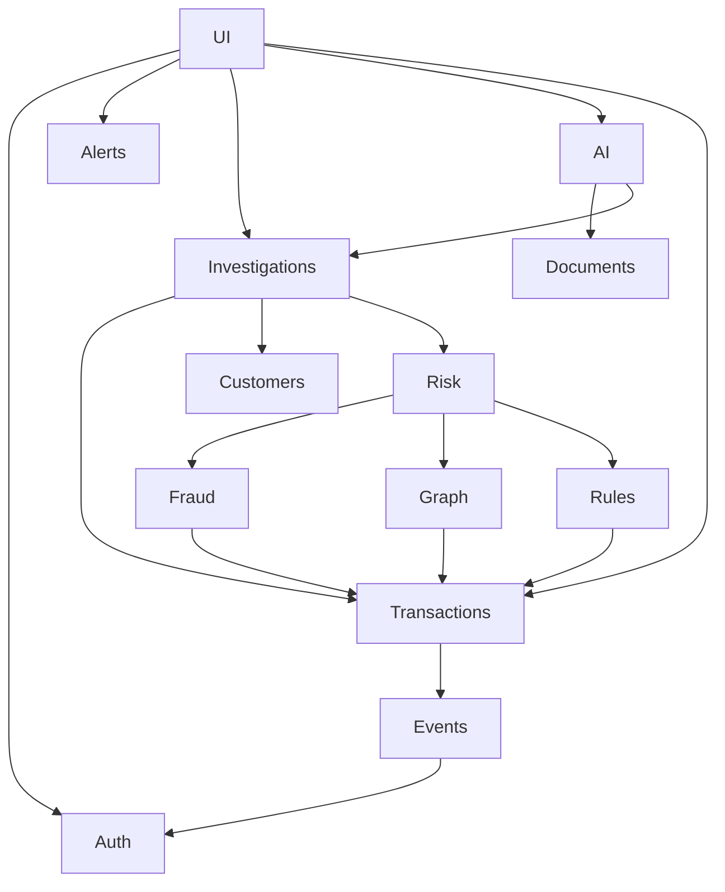

# Module Architecture

## Foundational Modules
- **auth:** JWT, RBAC, Passwords.
- **users:** System users, investigators.
- **audit:** System audit logs.
- **monitoring:** Health checks, metrics.

## Core Domain Modules
- **customers:** Profiles, segments.
- **accounts:** Account balances, limits.
- **transactions:** Core transaction ledger.
- **devices & locations:** Device fingerprints, Geo-IP mapping.
- **merchants & agents:** Business profiles, agent networks.

## Intelligence Modules (Core)
- **events:** Redis pub/sub routing, Celery tasks.
- **rules:** Deterministic logic.
- **fraud & anomaly:** Behavioral profiling, ML predictors.
- **graph:** NetworkX graph building, traversal.
- **risk:** Fusion engine, weighting.
- **customer_intelligence:** Customer behavior analytics.
- **financial_intelligence:** Cash flow and risk metrics.
- **merchant_intelligence:** Merchant fraud/risk monitoring.
- **agent_intelligence:** Agent network anomalies.

## AI & Investigation Modules
- **alerts:** Alert lifecycle.
- **investigations:** Case management.
- **documents & embeddings:** RAG prep, chunking.
- **ai:** Copilot chat, LLM prompt assembly.
- **feedback:** Investigator tuning.
- **simulation:** What-if scenarios, rule backtesting.

## Dependency Graph


## Repository Blueprint
```text
upay_nexus/
├── backend/
│   ├── app/
│   │   ├── api/          # FastAPI routers
│   │   ├── core/         # Config, Security, DB session
│   │   ├── models/       # SQLAlchemy models
│   │   ├── schemas/      # Pydantic schemas
│   │   ├── services/     # Business logic per module
│   │   ├── events/       # Celery tasks & Redis pubsub
│   │   └── ai/           # LLM logic & RAG
│   ├── alembic/          # Migrations
│   ├── tests/
│   └── main.py
├── frontend/             # Next.js app
├── ml/                   # Model training, jupyter notebooks
├── docker/               # Compose files, Dockerfiles
├── scripts/              # Synthetic data, management scripts
└── docs/                 # Architecture documents
```\n